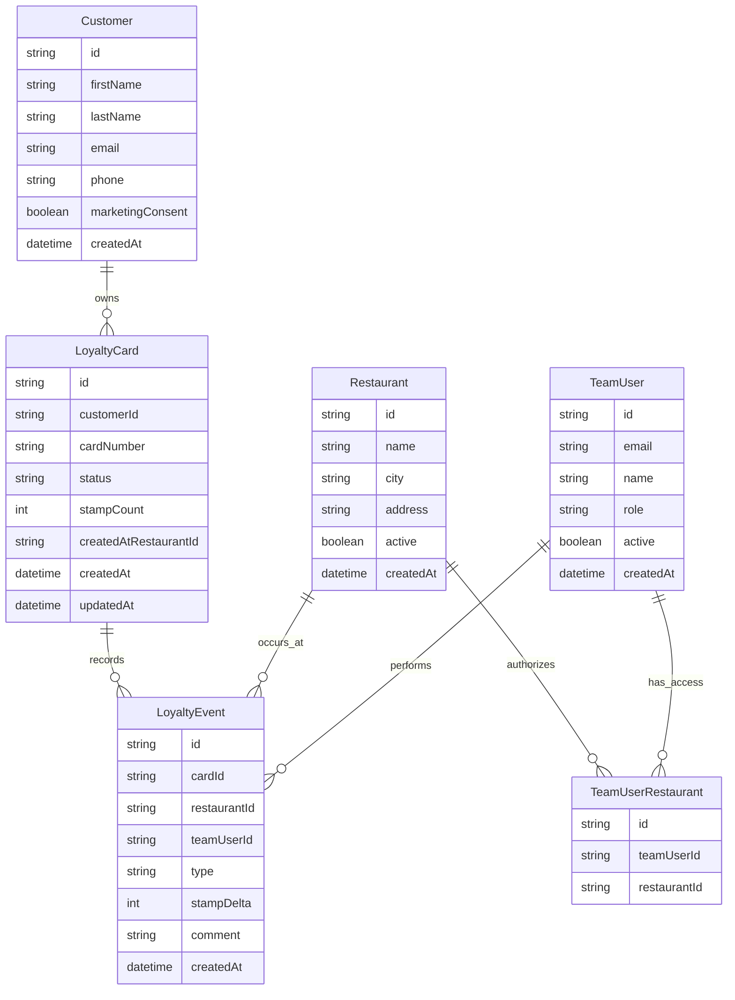

# Specification MVP - Fidelite Flam's

## Positionnement

Application web de fidelite pour une franchise de restaurants Flam's. Le systeme remplace une carte papier a tampons par une carte digitale consultable en ligne et ajoutable au Wallet du client.

Le MVP doit fonctionner sans integration caisse. L'ajout de tampons est donc effectue manuellement par l'equipe du restaurant via une interface web securisee.

## Perimetre MVP

### Inclus

- Creation d'une carte client.
- Consultation de la carte digitale.
- QR code unique par carte.
- Interface restaurant pour scanner ou rechercher une carte.
- Ajout de tampons apres achat.
- Utilisation d'une recompense.
- Journal des actions.
- Gestion multi-restaurants.
- Roles simples : employe, manager, admin franchise.
- Preparation technique Apple Wallet et Google Wallet.

### Hors MVP

- Integration caisse.
- Paiement.
- Application mobile native.
- Campagnes marketing avancees.
- Systeme de coupons complexe.
- Programme de niveaux VIP.
- Parrainage.

## Regles metier

### Carte a tampons

- Une carte appartient a un client.
- Une carte active contient un compteur de tampons.
- Un achat eligible donne droit a un tampon.
- Quand le seuil est atteint, une recompense devient disponible.
- Quand la recompense est utilisee, le systeme archive le cycle precedent et redemarre un nouveau cycle.

### Multi-restaurant

- Les clients peuvent utiliser leur carte dans les restaurants participants.
- Chaque tampon est associe au restaurant qui l'a ajoute.
- Les managers ne voient que leurs restaurants.
- L'admin franchise voit l'ensemble du reseau.

### Securite operationnelle

- Chaque action equipe est tracee.
- Un employe ne peut pas ajouter de tampon sans etre connecte.
- Un manager peut corriger une action.
- Les corrections doivent etre historisees, pas supprimees silencieusement.

## Ecrans

### Client - Creation de carte

Champs :

- prenom,
- nom,
- email ou telephone,
- opt-in marketing,
- acceptation des conditions.

Actions :

- creer ma carte,
- se connecter si carte existante.

### Client - Ma carte

Contenu :

- marque Flam's,
- prenom client,
- progression des tampons,
- recompense disponible ou prochaine recompense,
- QR code,
- bouton Apple Wallet,
- bouton Google Wallet,
- historique recent.

### Restaurant - Connexion equipe

Champs :

- email,
- mot de passe ou magic link.

### Restaurant - Scan

Contenu :

- lecteur QR code,
- recherche manuelle par telephone/email,
- restaurant actif de la session.

### Restaurant - Detail carte

Contenu :

- client,
- nombre de tampons,
- statut recompense,
- historique recent.

Actions :

- ajouter un tampon,
- utiliser la recompense,
- signaler une anomalie.

### Admin - Restaurants

Contenu :

- liste des restaurants,
- statut actif/inactif,
- ville,
- nombre de cartes creees,
- activite recente.

Actions :

- creer restaurant,
- modifier restaurant,
- desactiver restaurant.

### Admin - Utilisateurs

Contenu :

- liste des utilisateurs,
- role,
- restaurants autorises,
- derniere connexion.

Actions :

- inviter utilisateur,
- changer role,
- desactiver utilisateur.

### Admin - Statistiques

Indicateurs :

- cartes creees,
- clients actifs,
- tampons ajoutes,
- recompenses utilisees,
- taux de cartes completes,
- activite par restaurant.

## Modele de donnees initial

## API MVP

### Public client

- `POST /api/customers`
  - cree un client et une carte.
- `GET /api/cards/:cardNumber`
  - retourne l'etat public de la carte.
- `GET /api/cards/:cardNumber/apple-wallet`
  - genere ou retourne le pass Apple Wallet.
- `GET /api/cards/:cardNumber/google-wallet`
  - genere un lien Google Wallet.

### Restaurant

- `GET /api/restaurant/cards/:cardNumber`
  - retourne la fiche carte complete pour l'equipe.
- `POST /api/restaurant/cards/:cardNumber/stamp`
  - ajoute un tampon.
- `POST /api/restaurant/cards/:cardNumber/redeem`
  - utilise la recompense.
- `GET /api/restaurant/events`
  - liste l'historique du restaurant.

### Admin

- `GET /api/admin/restaurants`
- `POST /api/admin/restaurants`
- `PATCH /api/admin/restaurants/:id`
- `GET /api/admin/users`
- `POST /api/admin/users/invite`
- `PATCH /api/admin/users/:id`
- `GET /api/admin/stats`

## Priorite de developpement

1. Initialiser l'application Next.js.
2. Ajouter base de donnees et Prisma.
3. Creer les modeles Restaurant, Customer, LoyaltyCard, LoyaltyEvent, TeamUser.
4. Construire le parcours client sans Wallet.
5. Construire l'interface restaurant scan/recherche.
6. Ajouter l'ajout de tampons et l'utilisation de recompense.
7. Ajouter l'admin minimal.
8. Ajouter generation Apple Wallet.
9. Ajouter integration Google Wallet.
10. Durcir securite, audit et anti-abus.

## Questions a valider avec Flam's

- Le nombre de tampons est-il 10 ou un autre seuil ?
- Quelle recompense exacte est offerte ?
- La carte est-elle valable dans tout le reseau ou seulement dans certains restaurants ?
- Les franchises peuvent-elles personnaliser leur recompense ?
- La creation de carte doit-elle etre possible uniquement via QR code restaurant ?
- Faut-il collecter la date d'anniversaire ?
- Faut-il une communication marketing email/SMS des le MVP ?

